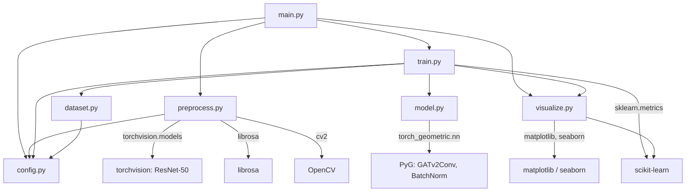

# Architecture Report — `goonpa_ps` (ST-GAT TTM)

> **Audit date:** 2026-04-20  
> **Auditor:** Code audit (read-only)  
> **Scope:** Every file in `/home/renith/goonpa_ps/`  
> **Rule:** No files were modified. All claims are backed by evidence in the source.

---

## Executive Summary

This repository implements a **Spatio-Temporal Graph Attention Network (ST-GAT)** for the **Ego4D Talking-To-Me (TTM)** binary classification task. Given egocentric video clips with bounding-box annotations, it builds a heterogeneous spatio-temporal graph per clip—where nodes represent *(person, frame)* pairs—and trains a GATv2 message-passing network to predict whether each visible person is talking to the camera wearer.

| Aspect | Detail |
|---|---|
| **Task** | Binary node classification (TTM = 0 or 1) |
| **Graph type** | Heterogeneous (3 edge types: spatial, temporal, temporal-skip) |
| **GNN backbone** | `GATv2Conv` from PyTorch Geometric |
| **Visual backbone** | ResNet-50 (ImageNet-pretrained, used only in preprocessing) |
| **Audio features** | MFCC via `librosa` (used only in preprocessing) |
| **Loss** | `BCEWithLogitsLoss` (default) or `FocalLossWithPosWeight` |
| **Primary metric** | Validation node-level mAP (used for early stopping & checkpointing) |

---

## Repository Tree

```
goonpa_ps/
├── config.py             # Dataclass-based configuration (all hyperparameters)
├── dataset.py            # PyG Dataset classes + graph construction logic
├── main.py               # CLI entry point (argparse subcommands)
├── model.py              # ST-GAT model, loss functions, edge-type embedding
├── preprocess.py         # Feature extraction (ResNet-50 face, MFCC audio, bbox)
├── train.py              # Training loop, validation, evaluation, metrics, checkpointing
├── visualize.py          # Plotting: training curves, ROC/PR, confusion matrix, EDA
├── requirements.txt      # Python dependency list
├── logs/
│   └── stgnn_ttm_v1/     # TensorBoard event directories (7 runs observed)
├── plots/
│   └── training_curves.png
└── checkpoints/           # Created at runtime by Config.__post_init__()
```

---

## Entry Points

### Primary: [main.py](file:///home/renith/goonpa_ps/main.py)

Invoked as `python main.py <command>`. The `main()` function (line 292) builds an `argparse` parser with six subcommands, instantiates `Config()`, and dispatches to the corresponding handler.

| Subcommand | Handler function | Purpose |
|---|---|---|
| `preprocess` | `cmd_preprocess` | Extract features from video clips |
| `train` | `cmd_train` | Train the ST-GAT model |
| `evaluate` | `cmd_evaluate` | Evaluate a checkpoint on the val set |
| `visualize` | `cmd_visualize` | Generate training / EDA plots |
| `eda` | `cmd_eda` | Exploratory data analysis on annotation JSON |
| `full` | `cmd_full` | Run preprocess → train → evaluate end-to-end |

### Secondary entry points

| File | Condition |
|---|---|
| [preprocess.py](file:///home/renith/goonpa_ps/preprocess.py) | Has `if __name__ == "__main__"` block (line 542) |
| [visualize.py](file:///home/renith/goonpa_ps/visualize.py) | Has `if __name__ == "__main__"` block (line 373) |

`train.py`, `dataset.py`, `model.py`, and `config.py` are **library modules only** — they have no `__main__` guard.

---

## Dependencies

From [requirements.txt](file:///home/renith/goonpa_ps/requirements.txt):

| Category | Packages |
|---|---|
| **Core DL** | `torch>=2.0.0`, `torchvision>=0.15.0`, `torchaudio>=2.0.0` |
| **Graph ML** | `torch-geometric>=2.4.0`, `torch-scatter`, `torch-sparse` |
| **Vision / Audio** | `opencv-python>=4.7.0`, `librosa>=0.10.0`, `soundfile>=0.12.0` |
| **ML utilities** | `scikit-learn>=1.2.0`, `numpy>=1.24.0`, `pandas>=2.0.0` |
| **Visualization** | `matplotlib>=3.7.0`, `seaborn>=0.12.0`, `tqdm>=4.65.0`, `tensorboard>=2.13.0` |
| **Optional** | `facenet-pytorch>=2.5.3` (listed but **never imported** in any source file) |

> [!NOTE]
> `pandas` is listed in requirements but is **never imported** in any source file. `facenet-pytorch` is likewise listed but unused.

---

## End-to-End Execution Flow

### 1. Preprocessing (`python main.py preprocess`)

```
main.py::cmd_preprocess()
  └─ preprocess.py::preprocess_split(split, cfg)
       ├─ load_annotations(json_path)         # reads JSON, groups by clip_uid
       ├─ if mode == "full":
       │    FaceFeatureExtractor(device)       # loads ResNet-50 (ImageNet V2)
       ├─ for each clip_uid:
       │    ├─ if mode == "full":  preprocess_clip_full(...)
       │    │    ├─ find_video_path(clip_uid, video_uid, cfg)
       │    │    ├─ read_video_frames(video_path, frame_indices)
       │    │    ├─ expand_bbox() → crop face regions
       │    │    ├─ face_extractor.extract_batch(crops)  # ResNet-50 → (N,2048)
       │    │    ├─ extract_audio_mfcc(video_path)       # librosa → (T, 40)
       │    │    └─ compute_bbox_features()              # → (6,)
       │    └─ if mode == "lite":  preprocess_clip_lite(...)
       │         └─ compute_bbox_features()              # → (6,) only
       └─ pickle.dump(result, f"{clip_uid}.pkl")
```

**Output:** One `.pkl` file per clip saved to `cfg.feature_dir/{split}/`.

### 2. Training (`python main.py train`)

```
main.py::cmd_train()
  └─ train.py::train(cfg, use_direct_dataset)
       ├─ set_seed(42)
       ├─ Load dataset:
       │    ├─ if --direct: TTMGraphDatasetDirect(json_path, cfg)
       │    └─ else:        TTMGraphDataset(split, cfg)
       ├─ DataLoader (PyG) for train + val
       ├─ SpatioTemporalGAT(cfg).to(device)
       ├─ criterion: BCEWithLogitsLoss or FocalLossWithPosWeight
       ├─ optimizer: AdamW
       ├─ scheduler: LinearLR warmup → CosineAnnealingWarmRestarts
       ├─ for epoch in 1..num_epochs:
       │    ├─ train_epoch() → metrics
       │    ├─ validate_epoch() → node_metrics, person_metrics
       │    ├─ scheduler.step()
       │    ├─ if val mAP improves → save_checkpoint("best_model.pt")
       │    ├─ every 10 epochs → save_checkpoint("checkpoint_epoch{N}.pt")
       │    └─ early stopping if patience exceeded
       └─ save training_history.json + auto-generate training_curves.png
```

### 3. Evaluation (`python main.py evaluate`)

```
main.py::cmd_evaluate()
  └─ train.py::evaluate(cfg, checkpoint_path)
       ├─ Load SpatioTemporalGAT + load_checkpoint()
       ├─ Forward pass on entire val set (no grad)
       ├─ compute_metrics() → node-level
       ├─ compute_person_metrics() → person-level aggregated
       ├─ Print confusion matrix
       └─ Save eval_results.json
```

### 4. Full Pipeline (`python main.py full`)

Chains: `cmd_preprocess` → `cmd_train` → `cmd_evaluate` with timing.

---

## Model Architecture

### Class: [SpatioTemporalGAT](file:///home/renith/goonpa_ps/model.py#L160-L271) (primary)

```
Input x: (N, node_input_dim)
                │
     ┌──────────▼──────────┐
     │   input_proj         │  Linear → LayerNorm → ELU → Dropout
     │  (node_input_dim →   │
     │   hidden_dim=256)    │
     └──────────┬──────────┘
                │
     ┌──────────▼──────────┐
     │   EdgeTypeEmbedding  │  Embedding(3, 64) → edge_attr
     │   (if use_edge_type) │
     └──────────┬──────────┘
                │
     ┌──────────▼──────────┐
     │  GAT Layers × L      │  L = cfg.num_gat_layers (default: 3)
     │  (ResidualGATBlock)   │
     │   ├─ GATv2Conv        │  heads=4, edge_dim=64
     │   ├─ Dropout          │
     │   ├─ LayerNorm        │
     │   ├─ Residual conn.   │  (with projection if dims mismatch)
     │   └─ ELU              │
     └──────────┬──────────┘
                │
     ┌──────────▼──────────┐
     │   classifier (MLP)   │  Linear(256→128) → LN → ELU → Dropout
     │                      │  Linear(128→64) → ELU → Dropout
     │                      │  Linear(64→1)
     └──────────┬──────────┘
                │
           logits (N,)       # per-node raw logits
```

**GAT layer sizing logic** (lines 193–216):
- **Intermediate layers** (i < L−1): `out_channels = hidden_dim // num_heads`, `concat=True` → actual output = `out_channels × heads = hidden_dim`
- **Final layer**: `out_channels = hidden_dim`, `concat=False` (mean over heads) → output = `hidden_dim`

**Weight initialization:** Xavier uniform for all `nn.Linear` layers, zeros for biases (line 234).

**Self-loops:** `add_self_loops=False` in `GATv2Conv` because self-loops are explicitly added during graph construction in `dataset.py`.

### Class: [SpatioTemporalGATWithPooling](file:///home/renith/goonpa_ps/model.py#L391-L443) (enhanced, defined but not used in training)

Extends `SpatioTemporalGAT` with a `TemporalAttentionPooling` module that aggregates node-level features per person using learned attention weights across frames. Returns both node-level and person-level logits.

> [!IMPORTANT]
> `SpatioTemporalGATWithPooling` is **defined** in `model.py` but **never instantiated** by `train.py`. Training always uses `SpatioTemporalGAT` (line 385 of `train.py`).

### Class: [TemporalAttentionPooling](file:///home/renith/goonpa_ps/model.py#L327-L388)

Attention MLP: `Linear(D → D/4) → Tanh → Linear(D/4 → 1)`. Pools per-person across frames with softmax-weighted sum. Only used inside `SpatioTemporalGATWithPooling`.

### Class: [EdgeTypeEmbedding](file:///home/renith/goonpa_ps/model.py#L95-L103)

Simple `nn.Embedding(3, 64)` mapping edge type indices {0, 1, 2} to 64-dim vectors, passed as `edge_attr` to `GATv2Conv`.

### Loss Functions

| Class | Location | Description |
|---|---|---|
| [FocalLoss](file:///home/renith/goonpa_ps/model.py#L25-L60) | model.py:25 | Standard focal loss with α, γ |
| [FocalLossWithPosWeight](file:///home/renith/goonpa_ps/model.py#L63-L88) | model.py:63 | Focal loss + per-sample pos_weight scaling |
| `BCEWithLogitsLoss` | train.py:398 | PyTorch built-in, used by default (`use_focal_loss=False`) |

**Default (used in practice):** `BCEWithLogitsLoss` with `pos_weight=17.51` (hardcoded in config, capped at 50.0 in train.py line 399).

### Backbones / Pretrained Models

| Model | Used in | Purpose |
|---|---|---|
| ResNet-50 (`IMAGENET1K_V2`) | `preprocess.py` `FaceFeatureExtractor` | Face feature extraction (2048-dim), frozen, used only at preprocessing time |

The ResNet-50 is **not** part of the trainable model. It is only used during preprocessing to produce static feature vectors saved to disk.

---

## Data Pipeline

### Source Data Format

**Annotations:** JSON files (e.g., `ttm_train_clean.json`, `ttm_val_clean.json`).

Each entry contains (inferred from code):

```json
{
    "clip_uid": "string",
    "video_uid": "string",
    "person_id": "int or string",
    "frame": "int",
    "bbox": [x, y, w, h],
    "ttm_label": 0 or 1
}
```

The JSON may be a list of entries or a dict with keys `"clips"`, `"data"`, or `"annotations"` wrapping a list. Both formats are handled.

**Videos:** MP4 files looked up via `find_video_path()` from `cfg.clips_dir` or `cfg.videos_dir`.

### Preprocessed Format

One `.pkl` file per clip, containing:

```python
{
    "face_features": {(pid, frame): np.array(2048,)},    # empty in lite mode
    "audio_features": np.array(num_frames, 40),            # None in lite mode
    "bbox_features":  {(pid, frame): np.array(6,)},
    "labels":         {(pid, frame): int},
    "bboxes":         {(pid, frame): np.array(4,)},
    "metadata": { "clip_uid", "video_uid", "person_ids", "frame_indices", "img_w", "img_h", "fps" }
}
```

### Node Feature Composition

| Mode | Components | Dimension |
|---|---|---|
| `full` | ResNet-50 face (2048) + MFCC audio (40) + bbox (6) | **2094** |
| `lite` | bbox only (6) | **6** |

Bbox features: `[center_x, center_y, norm_width, norm_height, aspect_ratio, area_ratio]`, all normalized.

### Graph Construction: [build_graph()](file:///home/renith/goonpa_ps/dataset.py#L30-L190)

**Nodes:** One node per `(person_id, frame)` pair. Sorted by `(frame, person_id)`.

**Hard cap:** If a clip has > 1000 frames, only the first 1000 are kept (line 59).

**Edge types (3 types):**

| Index | Constant | Type | Connection Rule |
|---|---|---|---|
| 0 | `EDGE_SPATIAL` | Spatial | Between different persons in the **same frame**, if Euclidean distance between bbox centers < `spatial_threshold` (400 px). Bidirectional. |
| 1 | `EDGE_TEMPORAL` | Temporal | **Same person** across consecutive frames within `temporal_stride` (1) frame difference. Bidirectional. Also used for **self-loops**. |
| 2 | `EDGE_TEMPORAL_SKIP` | Temporal Skip | **Same person** across non-adjacent frames where frame difference is in `(temporal_stride, temporal_skip]` i.e., exactly 2. Bidirectional. |

**Self-loops:** Added for every node, typed as `EDGE_TEMPORAL` (index 1).

> [!NOTE]
> There are **no gaze-directional edges** in this graph. The three edge types are: spatial, temporal, and temporal-skip.

### Dataset Classes

| Class | File | Input | Description |
|---|---|---|---|
| [TTMGraphDataset](file:///home/renith/goonpa_ps/dataset.py#L197-L294) | dataset.py | Preprocessed `.pkl` files | Loads per-clip pickles, calls `build_graph()` on the fly |
| [TTMGraphDatasetDirect](file:///home/renith/goonpa_ps/dataset.py#L302-L415) | dataset.py | Raw annotation JSON | Builds graphs directly from JSON (lite mode only), no preprocessing needed |

Both extend `torch_geometric.data.Dataset`.

### Train/Val Split

Splits are determined by which annotation JSON is loaded:
- **Train:** `cfg.train_annotation` → `"ttm_train_clean.json"`
- **Val:** `cfg.val_annotation` → `"ttm_val_clean.json"`

No test set is referenced in code. The split is **pre-determined** by the input files, not computed at runtime.

### DataLoaders

```python
train_loader = DataLoader(train_dataset, batch_size=cfg.batch_size, shuffle=True,
                          num_workers=4, pin_memory=True, drop_last=True)
val_loader   = DataLoader(val_dataset,   batch_size=cfg.batch_size, shuffle=False,
                          num_workers=4, pin_memory=True)
```

Uses `torch_geometric.loader.DataLoader` which handles batching of `PyG Data` objects.

### Oversampling

When `cfg.oversample_positive=True` (default), positive clips (containing at least one TTM=1 node) are repeated `cfg.oversample_ratio` (3.0) times in the training dataset index. This is a clip-level oversampling, not node-level.

---

## Training Pipeline

### Optimizer

```python
AdamW(model.parameters(), lr=5e-4, weight_decay=1e-4)
```

### LR Scheduler

Two-phase sequential scheduler:
1. **Warmup** (epochs 1–5): `LinearLR(start_factor=0.01, end_factor=1.0)` — ramps LR from `5e-6` to `5e-4`
2. **Cosine annealing** (epochs 6–100): `CosineAnnealingWarmRestarts(T_0=95, T_mult=1)`

### Training Hyperparameters (defaults from Config)

| Parameter | Value |
|---|---|
| `batch_size` | 2 (Config default) / 32 (CLI default) |
| `lr` | 5e-4 |
| `weight_decay` | 1e-4 |
| `num_epochs` | 100 |
| `patience` | 15 (early stopping) |
| `warmup_epochs` | 5 |
| `grad_clip` | 1.0 (max grad norm) |
| `use_amp` | True |
| `seed` | 42 |

> [!IMPORTANT]
> The Config dataclass default `batch_size=2` is overridden by the CLI default of `32` when using `main.py train`. If `Config()` is used directly without the CLI, `batch_size=2` applies.

### AMP / Mixed Precision

Enabled by default (`cfg.use_amp=True`). Uses `torch.amp.GradScaler('cuda')` and `torch.amp.autocast('cuda')` in `train_epoch()`.

> [!WARNING]
> In `validate_epoch()` (line 182), AMP uses `autocast()` without the `torch.amp.` prefix and without passing `'cuda'` as the device type. This is inconsistent with `train_epoch()` (line 122 uses `torch.amp.autocast('cuda')`), and `autocast` is **never imported** in `train.py`. This would cause a `NameError` at runtime if `cfg.use_amp=True` during validation.

### Gradient Accumulation

Not implemented. Gradients are computed and applied every batch.

### Metrics Computed Per Epoch

| Metric | Scope |
|---|---|
| Loss | Train, Val (node) |
| AUC-ROC | Train, Val (node), Val (person) |
| mAP | Train, Val (node), Val (person) |
| F1 @ 0.5 | Train, Val (node) |
| Best-F1 (optimal threshold) | Train, Val (node) |
| Precision @ 0.5 | Train, Val (node) |
| Recall @ 0.5 | Train, Val (node) |
| Accuracy @ 0.5 | Train, Val (node) |

The **optimal threshold** is searched over `np.arange(0.1, 0.9, 0.05)` to maximize F1.

**Person-level metrics:** Nodes are grouped by `(clip_uid, person_id)`. Probabilities are aggregated by `cfg.eval_aggregate` (default: `"mean"`), labels by `max`. Then standard metrics are computed on the aggregated values.

### Checkpoint Saving

| Event | Filename |
|---|---|
| Best val mAP improves | `best_model.pt` |
| Every 10 epochs | `checkpoint_epoch{N:03d}.pt` |

Checkpoint contents: `epoch`, `model_state_dict`, `optimizer_state_dict`, `scheduler_state_dict`, `metrics`, `config.__dict__`.

### Early Stopping

Triggered when validation **node-level mAP** does not improve for `cfg.patience` (15) consecutive epochs.

### TensorBoard Logging

Conditional on `torch.utils.tensorboard` availability. Logs: Loss, AUC, mAP, Best-F1, LR to `cfg.log_dir/cfg.experiment_name/{timestamp}/`.

---

## Inference Pipeline

### Prediction flow ([evaluate()](file:///home/renith/goonpa_ps/train.py#L576-L666))

1. Instantiate `SpatioTemporalGAT(cfg)`
2. Load checkpoint via `load_checkpoint(model, path)` using `torch.load(..., weights_only=False)`
3. Set model to `eval()` mode
4. Forward pass on val dataset (no grad)
5. Collect raw logits → apply sigmoid → probabilities
6. Compute node-level and person-level metrics
7. Print confusion matrix at optimal threshold

### Thresholds

- **Default:** 0.5 for binary predictions
- **Optimal:** Best F1 threshold searched in `[0.1, 0.85)` with step 0.05

### Post-processing

**Person-level aggregation:** Group nodes by `(clip_uid, person_id)`, aggregate probabilities by mean (or max), aggregate labels by max (any positive frame → positive person).

> [!NOTE]
> In `evaluate()` (line 637), `compute_person_metrics` is called **without** `clip_uids` argument, but the function signature (line 260) requires it. Since Python allows this as a positional argument, `aggregate` would receive `all_person_ids`'s value, which is not a string. This appears to be a **bug** — the `evaluate()` function would likely crash or produce incorrect person-level metrics.

### Output Format

Results saved to `{checkpoint_dir}/eval_results.json`:

```json
{
    "node_metrics": { "auc_roc", "mAP", "f1", "precision", "recall", "accuracy", "best_f1", "best_threshold" },
    "person_metrics": { ... },
    "confusion_matrix": [[TN, FP], [FN, TP]],
    "best_threshold": float,
    "eval_time_seconds": float
}
```

---

## Config System

### Single source: [config.py](file:///home/renith/goonpa_ps/config.py) — `@dataclass Config`

All configuration is in a single Python dataclass. No YAML/JSON config files.

### Parameter Groups

#### Data Paths

| Parameter | Default | Used in |
|---|---|---|
| `data_root` | `/DATA/DL_21/wttm/ego4d_data/v2` | `preprocess.py`, `main.py` |
| `annotation_dir` | `/DATA/DL_21/wttm/ego4d_data/v2/annotations` | `preprocess.py`, `main.py` |
| `clips_dir` | `/DATA/DL_21/wttm/ego4d_data/v2/clips` | `preprocess.py` |
| `videos_dir` | `/DATA/DL_21/wttm/ego4d_data/v2/full_scale` | `preprocess.py` |
| `train_annotation` | `ttm_train_clean.json` | `preprocess.py`, `train.py` |
| `val_annotation` | `ttm_val_clean.json` | `preprocess.py`, `train.py` |
| `feature_dir` | `/DATA/DL_21/riceu/preprocessed_features` | `dataset.py`, `preprocess.py` |

#### Preprocessing

| Parameter | Default | Used in |
|---|---|---|
| `face_size` | 224 | Documented but actual resize is in `FaceFeatureExtractor.transform` |
| `n_mfcc` | 40 | `preprocess.py::extract_audio_mfcc` |
| `audio_sr` | 16000 | `preprocess.py::extract_audio_mfcc` |
| `bbox_format` | `"xywh"` | Documented only; code always assumes xywh |
| `bbox_pad_ratio` | 0.15 | `preprocess.py::expand_bbox` |

#### Graph Construction

| Parameter | Default | Used in |
|---|---|---|
| `spatial_threshold` | 400.0 | `dataset.py::build_graph` |
| `temporal_stride` | 1 | `dataset.py::build_graph` |
| `temporal_skip` | 2 | `dataset.py::build_graph` |
| `frame_sample_rate` | 3 | `dataset.py`, `preprocess.py` |
| `min_frames_per_clip` | 5 | `preprocess.py` |
| `EDGE_SPATIAL` | 0 | `dataset.py::build_graph` |
| `EDGE_TEMPORAL` | 1 | `dataset.py::build_graph` |
| `EDGE_TEMPORAL_SKIP` | 2 | `dataset.py::build_graph` |

#### Model Architecture

| Parameter | Default | Used in |
|---|---|---|
| `face_feat_dim` | 2048 | `config.py::__post_init__` |
| `audio_feat_dim` | 40 | `config.py::__post_init__` |
| `bbox_feat_dim` | 6 | `config.py::__post_init__` |
| `node_input_dim` | Auto (2094 full / 6 lite) | `model.py::SpatioTemporalGAT` |
| `hidden_dim` | 256 | `model.py` |
| `num_gat_layers` | 3 | `model.py` |
| `num_heads` | 4 | `model.py` |
| `gat_dropout` | 0.2 | `model.py` |
| `classifier_dropout` | 0.4 | `model.py` |
| `use_edge_type` | True | `model.py` |

#### Training

| Parameter | Default | Used in |
|---|---|---|
| `batch_size` | 2 | `train.py` |
| `lr` | 5e-4 | `train.py` |
| `weight_decay` | 1e-4 | `train.py` |
| `num_epochs` | 100 | `train.py` |
| `patience` | 15 | `train.py` |
| `warmup_epochs` | 5 | `train.py` |
| `focal_alpha` | 0.80 | `train.py` (if focal enabled) |
| `focal_gamma` | 2.0 | `train.py` (if focal enabled) |
| `pos_weight` | 17.51 | `train.py` |
| `use_focal_loss` | False | `train.py` |
| `oversample_positive` | True | `train.py`, `dataset.py` |
| `oversample_ratio` | 3.0 | `dataset.py` |
| `grad_clip` | 1.0 | `train.py` |
| `use_amp` | True | `train.py` |

#### Evaluation

| Parameter | Default | Used in |
|---|---|---|
| `eval_aggregate` | `"mean"` | `train.py::validate_epoch` |
| `tta` | False | **Not used anywhere in code** |

#### Misc

| Parameter | Default | Used in |
|---|---|---|
| `seed` | 42 | `train.py::set_seed` |
| `num_workers` | 4 | `train.py` |
| `device` | `"cuda"` | everywhere |
| `checkpoint_dir` | `./checkpoints` | `train.py` |
| `log_dir` | `./logs` | `train.py` |
| `experiment_name` | `stgnn_ttm_v1` | `train.py` |
| `feature_mode` | `"full"` | `preprocess.py`, `config.py` |

### Derived properties

- `train_json_path` → `os.path.join(annotation_dir, train_annotation)`
- `val_json_path` → `os.path.join(annotation_dir, val_annotation)`
- `node_input_dim` → auto-calculated in `__post_init__()`: 2094 (full) or 6 (lite)

---

## Module Dependency Graph



### Import chains

| Module | Imports from repo |
|---|---|
| `main.py` | `config.Config`, lazy: `preprocess.preprocess_split`, `train.train`, `train.evaluate`, `visualize.plot_training_curves`, `visualize.plot_dataset_statistics` |
| `preprocess.py` | `config.Config` |
| `train.py` | `config.Config`, `dataset.TTMGraphDataset`, `dataset.TTMGraphDatasetDirect`, `model.SpatioTemporalGAT`, `model.FocalLoss`, `model.FocalLossWithPosWeight`, `model.model_summary`, `model.count_parameters` |
| `dataset.py` | `config.Config` |
| `model.py` | *(no repo imports)* |
| `visualize.py` | *(no repo imports)* |
| `config.py` | *(no repo imports)* |

---

## Runtime Diagrams

### Training Flow

```
┌─────────────┐     ┌────────────────┐     ┌──────────────┐
│  Annotation  │────▶│  Preprocessor  │────▶│ .pkl files   │
│  JSON files  │     │  (ResNet+MFCC) │     │ per clip     │
└─────────────┘     └────────────────┘     └──────┬───────┘
                                                   │
                    ┌──────────────────────────────▼───────┐
                    │  TTMGraphDataset / Direct             │
                    │  ┌─────────────────────────────────┐ │
                    │  │ build_graph()                    │ │
                    │  │  • nodes = (person, frame) pairs │ │
                    │  │  • spatial edges (same frame)    │ │
                    │  │  • temporal edges (same person)  │ │
                    │  │  • temporal-skip edges           │ │
                    │  │  • self-loops                    │ │
                    │  └─────────────────────────────────┘ │
                    └──────────────────┬──────────────────┘
                                       │
                    ┌──────────────────▼──────────────────┐
                    │  PyG DataLoader                      │
                    │  (batched graphs)                    │
                    └──────────────────┬──────────────────┘
                                       │
          ┌────────────────────────────▼────────────────────────────┐
          │  Training Loop                                          │
          │  ┌──────────────────────────────────────────────────┐   │
          │  │  for epoch in 1..100:                            │   │
          │  │    train_epoch():                                │   │
          │  │      x → input_proj → [GAT×3] → classifier → σ  │   │
          │  │      loss = BCE(logits, labels)                  │   │
          │  │      loss.backward() + grad_clip + optimizer     │   │
          │  │    validate_epoch():                             │   │
          │  │      node metrics + person metrics               │   │
          │  │    if mAP↑ → save best_model.pt                 │   │
          │  │    if patience exhausted → early stop            │   │
          │  └──────────────────────────────────────────────────┘   │
          └────────────────────────────┬───────────────────────────┘
                                       │
                    ┌──────────────────▼──────────────────┐
                    │  Outputs:                            │
                    │  • best_model.pt                     │
                    │  • training_history.json              │
                    │  • training_curves.png                │
                    │  • TensorBoard logs                   │
                    └─────────────────────────────────────┘
```

### Inference Flow

```
┌───────────────┐     ┌──────────────────┐     ┌────────────────┐
│ best_model.pt │────▶│ SpatioTemporalGAT│────▶│ Node logits    │
└───────────────┘     │ (eval mode)      │     │ (N,)           │
                      └──────────────────┘     └───────┬────────┘
                                                       │
                                                       ▼
                                               ┌──────────────┐
                                               │ sigmoid(·)   │
                                               └──────┬───────┘
                                                      │
                                         ┌────────────┴────────────┐
                                         ▼                         ▼
                                  ┌──────────────┐         ┌──────────────────┐
                                  │ Node-level   │         │ Person-level     │
                                  │ metrics      │         │ group by         │
                                  │ @ thresh 0.5 │         │ (clip, person)   │
                                  │ + best F1    │         │ aggregate: mean  │
                                  └──────────────┘         └──────────────────┘
                                                                   │
                                                            ┌──────▼──────┐
                                                            │ Person-level│
                                                            │ metrics     │
                                                            └─────────────┘
```

### Module Interactions

```
                         ┌──────────┐
                         │ main.py  │  (CLI dispatcher)
                         └────┬─────┘
              ┌───────────────┼───────────────┬──────────────┐
              ▼               ▼               ▼              ▼
        ┌───────────┐  ┌───────────┐  ┌────────────┐  ┌───────────┐
        │preprocess │  │ train.py  │  │visualize.py│  │config.py  │
        │    .py    │  │           │  │            │  │ (shared)  │
        └───────────┘  └─────┬─────┘  └────────────┘  └───────────┘
                             │
                    ┌────────┴────────┐
                    ▼                 ▼
              ┌──────────┐     ┌──────────┐
              │dataset.py│     │ model.py │
              └──────────┘     └──────────┘
```

---

## Important Findings

### 1. Validation AMP Bug

In [train.py:182](file:///home/renith/goonpa_ps/train.py#L182), the validation epoch uses `autocast()` which is **not imported** in the module. The training epoch (line 122) correctly uses `torch.amp.autocast('cuda')`. This inconsistency means validation under AMP would raise a `NameError`.

### 2. Evaluate Function Missing Argument

In [train.py:637](file:///home/renith/goonpa_ps/train.py#L637), `compute_person_metrics` is called with 3 positional args `(all_probs, all_labels, all_person_ids)`, but the function signature requires 4 positional args including `clip_uids` (line 260). The missing `clip_uids` means `aggregate` receives the value of `all_person_ids` instead of `"mean"`, which would cause incorrect behavior or a crash.

### 3. Unused Model Variant

`SpatioTemporalGATWithPooling` and `TemporalAttentionPooling` are fully implemented in `model.py` but never used by the training pipeline. Only `SpatioTemporalGAT` is instantiated.

### 4. Unused Imports / Dependencies

| Item | Status |
|---|---|
| `model.FocalLoss` | Imported in `train.py` but never instantiated (only `FocalLossWithPosWeight` or `BCEWithLogitsLoss` used) |
| `model.count_parameters` | Imported in `train.py`, called via `model_summary()` |
| `torch_geometric.nn.BatchNorm` | Imported in `model.py` but never used |
| `torch_geometric.nn.global_mean_pool` | Imported in `model.py` but never used |
| `torch_geometric.utils.softmax` | Imported in `model.py` but never used |
| `facenet-pytorch` | In requirements.txt but never imported |
| `pandas` | In requirements.txt but never imported |

### 5. Config Parameter `tta`

`cfg.tta = False` is defined but **never referenced** in any code path. Test-time augmentation is not implemented.

### 6. Config Parameter `bbox_format`

`cfg.bbox_format = "xywh"` is defined as documentation only. The code always assumes xywh format without checking this parameter.

### 7. Hardcoded `pos_weight`

`cfg.pos_weight = 17.51` is hardcoded and only recomputed at runtime if `pos_weight <= 0`. The comment states this corresponds to `4778407 neg / 272901 pos` from the Ego4D TTM dataset.

### 8. Focal Loss Disabled by Default

Despite extensive focal loss implementation (`FocalLoss`, `FocalLossWithPosWeight`), `cfg.use_focal_loss = False`. The comment explains: "Disabled to prevent double-weighting (use pure BCE with pos_weight=17.51)".

### 9. Temporal Edge Construction Complexity

The temporal edge construction (lines 149–164 in `dataset.py`) uses a nested loop `O(F²)` per person (where F = number of frames per person). For clips with many frames this could be expensive, though the 1000-frame cap mitigates worst cases.

---

## Unknown / Not Confirmed

| Item | Status |
|---|---|
| **Test set** | No test split referenced in code. Only train and val. |
| **Face detection / MTCNN** | `facenet-pytorch` is in requirements but never imported. Face crops are done purely via bbox annotation coordinates. |
| **Actual dataset size** | Comment mentions ~4.78M negative, ~273K positive samples. Not confirmed from code execution. |
| **Video resolution** | Lite mode hardcodes 1920×1080. Full mode reads from video. Whether all videos are actually 1920×1080 is not confirmed. |
| **Checkpoint format compatibility** | `weights_only=False` in `torch.load` — whether existing checkpoints are compatible with current model class is not confirmed. |
| **TensorBoard event contents** | 7 run directories exist under `logs/stgnn_ttm_v1/` but their contents were not inspected. |
| **Training history contents** | Whether `training_history.json` exists in `checkpoints/` is not confirmed. |
| **`plots/training_curves.png`** | File exists (201 KB) but its contents were not inspected. |
